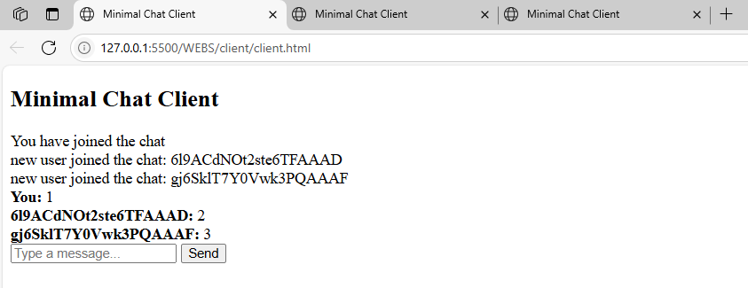
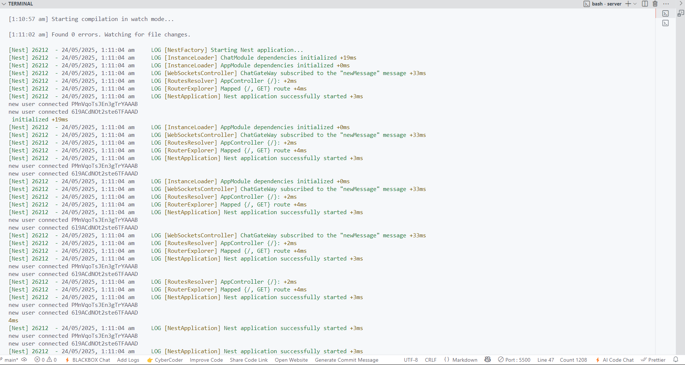
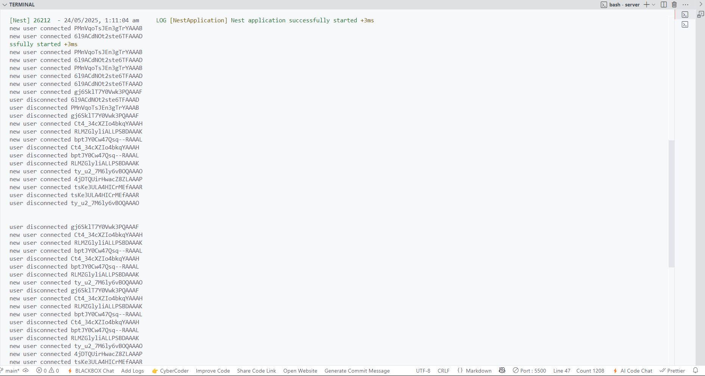
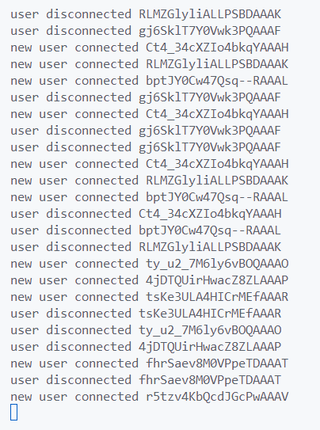

# Minimal NestJS WebSocket Chat Example

This project demonstrates a minimal real-time chat application using [NestJS](https://nestjs.com/) and [Socket.IO](https://socket.io/) for the backend, with a simple HTML/JavaScript client.

---

## Folder Structure

```
WEBS/
├── client/
│   └── client.html         # Minimal HTML chat client
└── server/
    ├── src/
    │   ├── app.controller.ts
    │   ├── app.module.ts
    │   ├── app.service.ts
    │   └── chat/
    │       ├── chat-gateway.ts
    │       └── chat.module.ts
    ├── package.json
    ├── tsconfig.json
    └── ... (NestJS config and test files)
```

---

## How It Works

- **Server:**

  - Built with NestJS and Socket.IO.
  - Listens for WebSocket connections on port `3002`.
  - Broadcasts chat messages and user join/leave notifications.
  - When a user joins, all other users are notified (but not the joining user).
  - All messages are broadcast with the sender's client ID.

- **Client:**
  - Simple HTML page using Socket.IO client.
  - Connects to the server at `http://localhost:3002`.
  - Displays messages and join notifications in real time.
  - Shows "You" for your own messages, and the client ID for others.

---

## Testing:





